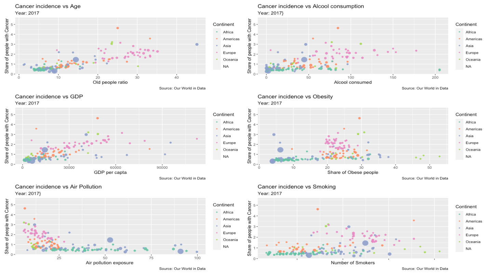

```{r setup, include=FALSE}
knitr::opts_chunk$set(echo = TRUE, message=FALSE, warning=FALSE)
```

# Introduction and research question 

Life-Expectancy has constantly increased over the last centuries, and it has never been so high as nowadays. Medicine has taken great strides forward, eradicating and finding cures for a lot of mortal diseases. Having said that, there are still other big challenges that we have to face in medicine and one of those is for sure cancer. [Cancer is a leading cause of death all over the world, accounting for almost 10 milion deaths in 2020](https://www.who.int/news-room/fact-sheets/detail/cancer). 
This is the reason why we thought that would be very interesting to analyze the principal factors that, according to state-of-the-art scientific research, cause this disease. We also wanted to divide these factors in some macro-groups of variables: environmental, life-style related and socio-economical/demographic. 

Our analysis (purely statistical) aims to verify if it is indeed possible using data about the selected risk factors to predict the share of people with cancer in a given year and in a given country. Moreover, we tried to improve our all-inclusive model by finding out the best model out of the above mentioned factors.

# Dataset, Data Cleaning and Data Visualization

## Source

Our research started by searching out on some reliable websites what are the leading causes of cancer and dividing them into the macro-categories. To do that we adopted the [WHO official website](https://www.who.int/news-room/fact-sheets/detail/cancer) and we selected the following risk factors:

*ENVIRONMENTAL*: Air pollution 
*LIFE-STYLE RELATED*: Alcohol consumption, Tobacco consumption, Obesity 
*SOCIO-ECONOMICAL/DEMOGRAPHIC*: GDP, Share of old people

(IMPORTANT DISCLAMER: of course the factors defined under "Socio-Economical/Demographic" cannot be considered to __cause__ cancer, but as we will see they turn out to be very useful to model cancer all over the world and over time)

## Description of the variables

We built our dataset selecting by merging different csv files all taken from the same source, that is ["Our world in data"](https://ourworldindata.org/). This is by itself collecting datasets from verified sources and the precise reference for each factor is given in the sitography at the end of the paper. Here we provide a complete description of the variable we decided to use in our model.

**Cancer**: Share of total population with any form of cancer, measured as the age-standardized percentage. This share has been age-standardized assuming a constant age structure to compare prevalence between countries and through time.

**Air_pollution**: Population-weighted average level of exposure to concentrations of suspended
particles measuring less than 2.5 microns in diameter (PM2.5). Exposure is measured in micro grams of PM2.5 per cubic meter (µg/m³).

**Alcohol**: Average per capta consumption of alcoholic beverages, measured in kilograms per
year. Data is based on per capta food supply at the consumer level, but does not account for food waste at the consumer level

**GDP per capta**: Measured in constant international-$

**Obesity**: Obesity is defined as having a body-mass index (BMI) equal to or greater than 30. BMI is a person's weight in kilograms divided by his or her height in meters squared.

**Old age Dependency**: This is the ratio of the number of people older than 64 relative to the
number of people in the working-age (15-64 years). Data are given as the proportion of dependents per 100 working-age population.

**Smoking**: Share of population who smoke every day.

## Constructing the table

We started by loading all the different csv files. Then we took the column we were interested in and we glued them together. After some other little manipulation (see the R code for that) here is how part of the final table looks like (the complete table with the N.A.s results in a dimension of 6468x11):

```{r, echo = FALSE}
##We start by loading some useful libraries that we will need during this process

library(readr) #Used to read the csv
library(tidyverse) #Contains a lot of useful packages to clean the datas
library(gganimate) #To create animated plots
library(ggthemes) #To select some nice themes 
library(zoo) #To fill the N.A. values 
library(grid) #To display plots into a grid
library(gridExtra) #To display plots into a grid
library(ggpubr)#To display plots into a grid

##We now load the row csv files what we need to merge 

Cancer <- read_csv("Datasets/Cancer.csv")
Air_pollution <- read_csv("Datasets/Air pollution.csv")
Alcool <- read_csv("Datasets/Alcool.csv")
GDP_per_capta <- read_csv("Datasets/GDP per capta.csv")
Obesity <- read_csv("Datasets/Obesity.csv")
Old_age_dependency_ratio <- read_csv("Datasets/Old age dependency ratio.csv")
Smoking <- read_csv("Datasets/Smoking.csv")
Population <- read_csv("Datasets/population-since-1800.csv")
countryContinent <- read_csv("Datasets/countryContinent.csv")

#We proceed by taking the explanatory variable data set (Cancer) and adding the covariates as columns other columns, to do that we use the use the libraby "dplyr" as it makes it very easy to do and readable

Continent = countryContinent %>% select(country, continent)
Continentt = rename(Continent, Entity = country)
Cancer1 = left_join(Cancer, Air_pollution, by = c("Entity", "Code", "Year"))
Cancer2 = left_join(Cancer1, Alcool, by = c("Entity", "Code", "Year"))
Cancer3 = left_join(Cancer2, GDP_per_capta, by = c("Entity", "Code", "Year"))
Cancer4 = left_join(Cancer3, Obesity, by = c("Entity", "Code", "Year"))
Cancer5 = left_join(Cancer4, Old_age_dependency_ratio, by = c("Entity", "Code", "Year"))
Cancer6 = left_join(Cancer5, Smoking, by = c("Entity", "Code", "Year"))
Cancer7 = left_join(Cancer6, Continentt, by = "Entity")
Cancer_final = Cancer7

rm("Cancer1", "Cancer2", "Cancer3", "Cancer4", "Cancer5", "Cancer6", "Cancer7")
rm("Air_pollution", "Alcool", "Cancer", "GDP_per_capta", "Obesity", "Old_age_dependency_ratio", "Smoking", "Continent", "Continentt", "countryContinent")

#We now proceed by renaming the columns. This will make all the manipulations of the dataframe more readable:

colnames(Cancer_final)[4] <- "Cancer"
colnames(Cancer_final)[5] <- "AirPoll"
colnames(Cancer_final)[6] <- "Alcool"
colnames(Cancer_final)[7] <- "GDP"
colnames(Cancer_final)[8] <- "Obesity"
colnames(Cancer_final)[9] <- "Age"
colnames(Cancer_final)[10] <- "Smoking"

Cancer_final
write.csv(Cancer_final, "Cancer_final.csv", row.names=FALSE, quote=FALSE) #to save the file into our environment
```

## Data Visualization

Now we will proceed with some plotting. Again, for the detailed process for making this graphs please refer to the R script. You may also want to check our our file in Html format, in which we made some nice animation to be able to display the evolution in time of the variables.

We start by displaying the variable we are interested in, that is the share of population with any form of cancer. In this static image, we chose to plot the most recent year in our data frame, that is 2017. 
As we can clearly see form the plot below the countries which are suffering more (in percentage) of cancer are USA, Canada, Australia and Greenland. These states are followed by European countries. Asian and African countries are the ones with relatively less cases of cancer in percentage. 
Here we could argue that a big downside of this picture is the fact that different countries have different ability in the process of screening. As the WHO writes "Late-stage presentation and lack of access to diagnosis and treatment are common, particularly in low- and middle-income countries". We will further discuss this limitation in the dedicated section. 
(Countries for which data were not available are omitted from the map, but those are luckily few)

```{r, echo = FALSE}
#We read the file needed
share_of_population_with_cancer <- read_csv("Cancer.csv")  #read the file 
share_of_population_with_cancer = data.frame(lapply(share_of_population_with_cancer, function(x) {
  gsub("United States", "USA", x) #correction needed for the mapping 
}))
colnames(share_of_population_with_cancer)[1] <- "region" #Give the same name for the country in the two datasets
colnames(share_of_population_with_cancer)[4] <- "cancer" #Dropping the complicated name given by the data frame

# Create the actual map that we will use
#We will use the ggplo2 package for that

mapdata = map_data("world") #Used to take the latitude and longitude of the countries 
mapp <- mapdata %>%
  left_join(share_of_population_with_cancer, by = "region") #merge the two datasets
mapp2 = mapp %>% 
  filter(!is.na(mapp$cancer)) #dealing with NA
mapp2$cancer <- as.numeric(mapp2$cancer) #changing the value to numeric for plotting
mapp2$Year <- as.numeric(mapp2$Year) #changing the value to numeric for animation
```


```{r, eval = FALSE, echo= FALSE}
# Building the map
#Here we create a static map
ggplot( data = mapp2, aes(long, lat, group = subregion)) +
  geom_map(
    aes(map_id = region),
    map = mapdata,
    color = "black", fill = "gray30", size = 0.3
  ) +
  geom_polygon(aes(group = group, fill = cancer), color = "black") +
  scale_fill_gradient2(low = "blue", high = "red" , midpoint = 1.0355583) +
  theme_minimal() +
  labs(
    title = "Share of population with cancer in 2017",
    x = "", y = "", fill = ""
    ) +
  theme_bw()
ggsave("Share of people with cancer in 2017.jpg")
```

```{r, echo= FALSE}
knitr::include_graphics("Share of people with cancer in 2017.jpg") #We use it to display the graphic
```

Now we are going to explore the dataset by plotting each selected factor against the Cancer one to start having an idea of some possible relation. Because we selected them as "risk factors" we would expect to see some positive correlation going on. To be consistent with what we have done above we again plot the graphs relative to the year 2017. We also used some libraries to make plots nicer by coloring the points according to the continent and by changing the size according to the population of the country. 
The result is the following:

```{r, echo = FALSE}
Cancergraph = left_join(Cancer_final, Population, by = c("Entity", "Code", "Year"))
Cancergraph$Smoking = na.locf(Cancergraph$Smoking)
Cancergraph$AirPoll = na.locf(Cancergraph$AirPoll)
Cancergraph$Alcool = na.locf(Cancergraph$Alcool)
Cancergraph$GDP = na.locf(Cancergraph$GDP, fromLast = TRUE)
Cancergraph$Age = na.locf(Cancergraph$Age)
Cancergraph$Obesity = na.locf(Cancergraph$Obesity)
Cancergraph$`Population (historical estimates)` = na.locf(Cancergraph$`Population (historical estimates)`)


#Here we plots

Cancergraph = subset(Cancergraph, Year == "2017")
graphPoll = Cancergraph %>%
  ggplot(aes(x = AirPoll, y = Cancer, color = continent, size = `Population (historical estimates)`)) +
  geom_point(alpha = 0.9, stroke = 0) +
  scale_size(range = c(2,12), guide = "none") +
  scale_color_brewer(palette = "Set2") +
  labs(title = "Cancer incidence vs Air Pollution", 
       x = "Air pollution exposure ", 
       y = "Share of people with Cancer",
       color = "Continent",
       caption = "Source: Our World in Data") +
  labs (subtitle = "Year: 2017}") 


graphAlco = Cancergraph %>%
  ggplot(aes(x = Alcool, y = Cancer, color = continent, size = `Population (historical estimates)`)) +
  geom_point(alpha = 0.9, stroke = 0) +
  scale_size(range = c(2,12), guide = "none") +
  scale_color_brewer(palette = "Set2") +
  labs(title = "Cancer incidence vs Alcool consumption", 
       x = "Alcool consumed", 
       y = "Share of people with Cancer",
       color = "Continent",
       caption = "Source: Our World in Data") +
  labs (subtitle = "Year: 2017") 


graphGDP = Cancergraph %>%
  ggplot(aes(x = GDP, y = Cancer, color = continent, size = `Population (historical estimates)`)) +
  geom_point(alpha = 0.9, stroke = 0) +
  scale_size(range = c(2,12), guide = "none") +
  scale_color_brewer(palette = "Set2") +
  labs(title = "Cancer incidence vs GDP", 
       x = "GDP per capta", 
       y = "Share of people with Cancer",
       color = "Continent",
       caption = "Source: Our World in Data") +
  labs (subtitle = "Year: 2017") 


graphObes = Cancergraph %>%
  ggplot(aes(x = Obesity, y = Cancer, color = continent, size = `Population (historical estimates)`)) +
  geom_point(alpha = 0.9, stroke = 0) +
  scale_size(range = c(2,12), guide = "none") +
  scale_color_brewer(palette = "Set2") +
  labs(title = "Cancer incidence vs Obesity", 
       x = "Share of Obese people", 
       y = "Share of people with Cancer",
       color = "Continent",
       caption = "Source: Our World in Data") +
  labs (subtitle = "Year: 2017") 


graphAge = Cancergraph %>%
  ggplot(aes(x = Age, y = Cancer, color = continent, size = `Population (historical estimates)`)) +
  geom_point(alpha = 0.9, stroke = 0) +
  scale_size(range = c(2,12), guide = "none") +
  scale_color_brewer(palette = "Set2") +
  labs(title = "Cancer incidence vs Age", 
       x = "Old people ratio", 
       y = "Share of people with Cancer",
       color = "Continent",
       caption = "Source: Our World in Data") +
  labs (subtitle = "Year: 2017") 


graphSmoke = Cancergraph %>%
  ggplot(aes(x = Smoking, y = Cancer, color = continent, size = `Population (historical estimates)`)) +
  geom_point(alpha = 0.9, stroke = 0) +
  scale_size(range = c(2,12), guide = "none") +
  scale_color_brewer(palette = "Set2") +
  labs(title = "Cancer incidence vs Smoking", 
       x = "Number of Smokers", 
       y = "Share of people with Cancer",
       color = "Continent",
       caption = "Source: Our World in Data") +
  labs (subtitle = "Year: 2017") 


pplot = ggarrange(graphAge, graphAlco, graphGDP, graphObes, graphPoll, graphSmoke + rremove("x.text"), ncol = 2, nrow = 3)

 #This is the visualization of pplot but in a clearer way 
```


Our hypothesis is confirmed: evidently there's some sort of positive correlation, but still not strong as we imagined beforehand. We can see that age is the factor which presents a stronger correlation visually.The only problem is the one related to Air pollution. Our explanation for that is that will be provided in the section "Limitations of the study".

We also have some outliers, which are Canada and US (The two orange points that on each graph are above the others). Being cancer causes such a complicated and intricate thing, is actually quite difficult to really understand why exactly those two countries have such an high number of cases. We can suppose that these two countries perform a more intense screening activity, but this goes beyond the scope of this study. We will just delete these two countries from our data set. Having said that, the result that follow will be not significantly changed by this action.

# Multivariate Linear Regression

We are now going to perform a multivariate linear regression, trying to examine the relationship between some explanatory variable and one response variable. As mentioned before, we are going to take into consideration as explanatory variables all the factors selected to help us trying to explain part of the variance of the share of people affected by cancer worldwide. The table used is considering approximately 150 countries for approximately 20 years. In this way we will be able to do not miss some trend or to do not being deceived from some outliers years/countries or random trends. 


Now, let’s proceed with performing the actual multiple linear regression. After that, we want to see if the assumptions required to state the statistical significance are met: we'll check for the normality and for the homoscedasticity of the residuals.


```{r, echo = FALSE}
library(olsrr)

# Delete the N.A.s
mydata = read.csv("Cancer_final.csv")
data5 = na.omit(mydata)

# Delete USA and Canada from the data set
data3 = subset(data5, Entity != "USA" || Entity != "Canada")

#Normality of the residuals
model = lm( Cancer~ Smoking + Obesity + GDP + Age + AirPoll + Alcool, data = data3)

#Perform Testing for normality of residuals
ols_test_normality(model)

#plot histogram of residuals
kop = residuals.lm(model)
hist(kop, breaks = 50)

#Check graphically using the function plot
plot(model)

```

Analyzing each of the test we performed above we see which conclusion we can take from what we observed.
For what concerns normality of the residuals, we can see that the p-values of the tests we performed is below the 0.05 significance level for all of them, thus we can reject the null hypothesis that the errors are normally distributed. This is exactly as we imagined: the data set is made by more or less  1000 data points, thus violating this assumption was something that we expected. This is due to the fact that with this many data points it's easy for the testing methods to find evidence against normality.
Trying to see the situation graphically, the setting seems a bit better. The qq-plot shows that the data fit not so badly the diagonal line, exceptions made for a little deviation near the top-right. Furthermore, analyzing another graph we see that plotting the residuals against the fitted values approximates more or less a straight line along zero. The analysis of the residuals is enough satisfying, but if we want to be strict we will say that we are not able to take out any significant conclusions from the experiments we will carry on.

We now perform and interpret the result of the multiple linear regression itself.

```{r, echo=FALSE}
summary(model)
```

From just this result, we can see various things: the value of the Adjusted R-Squared is very satisfying and this model fits pretty well the data, telling us there is a quite good relationship with the covariates we indicated: our factors explain an 82% variance in  the share of population with cancer! We are actually considering the Adjusted R-Squared since we are performing a multivariate linear regression, thus the number of factors we include in our model is relevant and we want to penalize bigger models. In fact we know that the value of R-Squared can just increase when adding more factors, even if those are completely random ones. 
In addition, all the variables seem to explain pretty well the share of cancer cases: almost all of the p-values are statistically significant! The only exception is given by the "Obesity" explanatory variable.


# Model Selection (Testing)

Now that we discussed the linear model and the underlying characteristics, we want to do some basic model selection to see if there are other models (possibly simpler) that are able to explain the dependent variable well enough. To do that we will leverage on two different approach to model selection. The first is the one provided by testing and the other the one provided by information theory. We will compare the results and see whether they coincide or not.

We start by importing the data we will need for the model selection and loading some useful libraries. We will then create our linear model using all the covariates and the dataset without the missing values (we will use the same model obtained above with the regression)

```{r, echo=FALSE}
library(olsrr) #This stands for Ordinary Least SquaRe Regression and it has the tools needed
model = lm( Cancer ~ Smoking + Obesity + GDP + Age + AirPoll + Alcool, data = data3)
summary(model)
```

We begin by trying three different testing methods, called respectively "Step-up/Forward", "Step-down/Backward" and "Step-both". The fist acts in a dual way with respect to the second and the last is in a way able to overcome the downsides of the first two models (I'll explain later what I mean by that). Without entering too much into the details this greedy methodology starts with no(all) predictors in the model and iteratively add(subtract) the one that is more statistically significant in contributing to the model. The procedure automatically stops when no other variables can be added to gain statistical significance. In practice what we do at each step is to perform an F-test (that reduces to a t-test) for each candidate variable and see which one has the lowest p-value (if there is one). In this setting we kept a significance level of 0.05 both for entering and for exiting the model.

The Step-up method yields:
```{r, echo=FALSE}
frwfit <- ols_step_forward_p(model, pent = 0.05)
frwfit
```

The selection led us to add to the model the "Age", "GDP", "Airpoll" and "Alcool". *BAAAM* We now try the symmetrical method,

The Step-down method yields:
```{r, echo=FALSE}
bkwfit <- ols_step_backward_p(model, prem = 0.05)
bkwfit
```

As you can see we got the same result here: we rejected the "Obesity" and the "Smoking" cofactor. Notice that even if the methods seem completely specular, it's not granted that they'll lead us to the same outcome. *DOUBLE BAAAM*
 
To do one last cross-check using testing methods we use a mixed method to allow variables that were added in previous steps to be excluded in succeeding steps (this wasn't allowed in the simple forward/step-up method)

The "Step-both" method yields:
```{r, echo=FALSE}
bothfit <- ols_step_both_p(model, pent = 0.05, prem = 0.05)
bothfit
```
But this again yields the same result as the one we got with the step forward method. As well as before, the fact that we obtained the same result with all the three approaches is a very likable. *TRIPLE BAAAAM*
This seems to suggest a model of four variables that is cutting "Smoking" and "Obesity", given that these two risk factor are removed by all three of our greedy methods.

We now try all together different methods based on Information criterion. These work in such a way that they penalize big models that otherwise would be selected by methods such as LSE and MLE. The math underneath this approach is absolutely non trivial and explaining it goes beyond the scope of this research. To implement this we will use the function "best_subset" That is returning the best model containing from one to six covariates. We therefore limit our comparison to the comparison between all the best subsets models that we can have.

```{r, echo=FALSE}
allsub2 <- ols_step_best_subset(model)
allsub2
```

This seems to suggest a different result. All of these criteria are suggesting that the best model is the one with all six explanatory variables except for the SBC method, which again is suggesting the model with four variables as before. This discrepancy can be explained by the fact that, at least for the Akaike Information Criteria, that we studied in class, the underlying constant C could dominate.  This method is in fact more suitable for models with different dimensions  |d|.  (Notice also the difference in AIC is very low: ($\Delta AIC = 2.59$ ). With small models AIC can easily prefer the complete model as the gain in “explained variance” obtained by adding a variable is more than the penalty introduced by that extra parameter. 

We conclude this section by saying that the best model after this  analysis is the one with four explanatory variables, obtained with the three step-wise method.

# Limitations of the study and Conclusions

Based on the results of our study, we can conclude that our last model explains quite well the variance in the data and that we collected about cancer and that some factors (for sure including the ones selected by us) are more influential than others in explaining the share of people suffering from cancer in each country. Relatively older and richer countries (the two things often overlap) present many more cancer cases in percentage than the others and the same we can conclude of countries with consumption of alcohol and cigarettes above the mean. However, our study has a lot of limitations that we must indicate. - First, as we had to construct the data set on our own, we encountered some difficulties: we joined some data together into a table, but obviously, we had some missing data. It’s not easy even just to collect the data in the same way for all the countries for more than 25 years for all those factors! - Secondly, we have to consider the difference in data availability that is present among the countries.  To give an example: it’s much easier to find a  data set about a  given topic regarding the  USA  with respect to one regarding  Burkina  Faso.  Besides that,  we have taken into considerations just six factors to try to explain cancer incidence, but as we know it is a much more difficult research question:  genetical heritage,  other factors concerning lifestyle,  other environmental elements, access to the healthcare system, prevention and treatment offered by the country and many more things play a  role in developing cancer or not. - Moreover, it is not an  ‘immediate’ disease: factors of risk sum up over the years and so do progress in medicine. This ends up in a complicated and intricate situation to analyze. Diving into some details, we also had a quite surprising result: the correlation between cancer cases and air pollution seems strongly negative, as the plot at the beginning shows.  It is difficult to explain such a result, but it may be that since the worst quality of air is on average in less developed countries (e.g. Nigeria, Pakistan, India…), it may be that other factors as the demographic distribution of the population or GDP, that typically obtain low values in those countries, have a stronger influence on the actual number of cancer cases, ending in this counter-intuitive result. The division that we made at the beginning seems to suggest that the  “non-risk factors” are the ones better suited to describe the distribution of cases worldwide, but again that’s what we wanted for this research: a merely descriptive approach. We conclude by saying that another interesting improvement to this research could be to try to repeat the same analysis but just focus on everyday habits and maybe by including the interaction effects within the possible covariates that we will choose in order to provide tips for a healthier routine.

*->Hope many of you got the StatQuest tribute<-*


# Sitography and Reference

The sources used for the datas are:
- Cancer -> [Global Burden of Disease Collaborative Network. Global Burden of Disease Study 2017 (GBD 2017) Results. Seattle, United States: Institute for Health Metrics and Evaluation (IHME), 2018](http://ghdx.healthdata.org/gbd-results-tool)
- Air_pollution -> [World Development Indicators - World Bank ](http://data.worldbank.org/data-catalog/world-development-indicators)
- Alcool -> [Food and Agriculture Organization of the United Nations (FAO) (2017)](http://www.fao.org/faostat/en/?#data/)
- GDP_per_capta -> [World Development Indicators - World Bank ](http://data.worldbank.org/data-catalog/world-development-indicators)
- Obesity -> [World Health Organization (WHO)](http://apps.who.int/gho/data/view.main.REGION2480A?lang=en)
- Old_age_dependency -> [World Development Indicators - World Bank](http://data.worldbank.org/data-catalog/world-development-indicators)
- Smoking -> [Nationally representative sources, survey data](http://ghdx.healthdata.org/record/global-smoking-prevalence-and-cigarette-consumption-1980-2012)